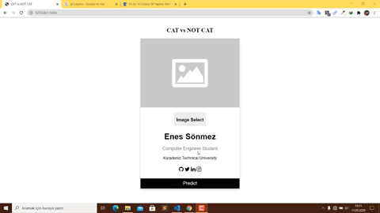

# Cat vs Not Cat Detection Flask App

Bu projede Andrew Ng Deep Learning kursunda öğrenilen klasik sinir ağı oluşturularak forward ve backward propagation işlemleri yapılarak kedi veri seti ile bir model oluşturulmuştur. Bu modele verilen resimde kedi olup olmadığını karşı tarafa bildirmektedir. Kullanıcı ile etkileşimini sağlamak amacıyla **Flask** framework'ü kullanılmıştır. Oluşturulan sinir ağı mimarisi aşağıdaki görseldeki gibidir.

